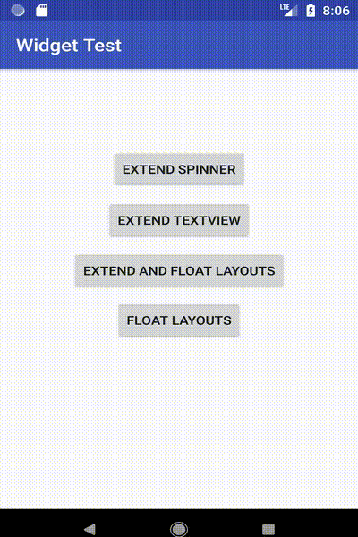
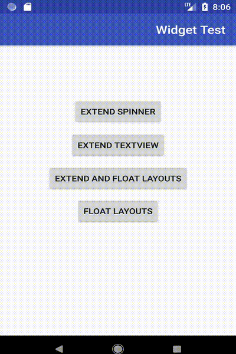

[](http://www.apache.org/licenses/LICENSE-2.0.html)
[](http://search.maven.org/#search%7Cga%7C1%7Ca%3A%22android-maven-gradle-plugin%22)
[](https://jitpack.io/#BrotherV/ToolsLibrary)
# Tools Library
**An extended library from different widgets such as Layouts, Spinner and TextView which have more features than original version**
### New Features in v0.1

#### ExtendSpinner
You can add what ever you want only in xml file without writing any JAVA code. By defining ExtendedSpinner in xml you can easily have a fully supported rtl/ltr spinner with too many options.

```xml
<com.bvtech.toolslibrary.Widget.ExtendSpinner
            android:id="@+id/extendSpinner"
            android:layout_width="wrap_content"
            android:layout_height="wrap_content"
            android:layout_gravity="center"
            android:layout_marginTop="8dp"
            app:entries="@array/test_str"  // you can easily add spinner items with a string-array
            app:entryValues="@array/test_entryValue" // you can change entry values of spinner by adding a string-array
            app:imageEntries="@array/test_img" // add image to spinner items by adding names of images in a string-array
            app:shapeType="rectangle" // you can set spinner shape rectangle or oval
            app:strokeColor="@color/colorAccent" // set stroke color of spinner
            app:strokeSize="2dp" // set spinner stroke size
            app:cornerRadius="2dp" // set spiner corner radius
            app:dropDownIcon="cornerIcon" // you can set drop down image by choosing "cornerIcon" or "simple"
            app:textColor="@color/colorAccent" // set spinner text color
            app:rtlTypeFace="font_fa" // set rtl direction font usage by adding fonts name (fonts must be in asset folder)
            app:ltrTypeFace="font_en" // set ltr direction font usage by adding fonts name (fonts must be in asset folder)
            />
```
* You can fill spinner programmatically with one of these methods.
``` java
fillSpinner(String[] mArray);
fillSpinner(String[] mArray, String[] mEntryValues);
fillSpinner(String[] mArray, int[] imageArray);
fillSpinner(String[] mArray, String[] mEntryValues, int[] imageArray);
fillSpinner(Context mContext, String[] mArray, int[] imageArray);
fillSpinner(Context mContext, String[] mArray, String[] mEntryValues, int[] imageArray, int tColor, int bColor, float tSize, float imgSize,  Typeface tf)
```


#### ExtendTextView
You can easily add rtl/ltr font in xml file just same as fontFamily attribute in android oreo, but it works for all version of android.

```xml
    <com.bvtech.toolslibrary.Widget.ExtendTextView
        android:layout_width="wrap_content"
        android:layout_height="wrap_content"
        android:layout_marginBottom="12dp"
        android:text="@string/app_hello"
        android:textSize="22sp"
        app:rtlTypeFace="font_fa" // set rtl direction font usage by adding fonts name (fonts must be in asset folder)
        app:ltrTypeFace="font_en" // set ltr direction font usage by adding fonts name (fonts must be in asset folder)
        />
```


#### ExtendConstraintLayout, ExtendCoordinatorLayout, ExtendFrameLayout, ExtendLinearLayout
You can insert objects in these layouts where yo want to move up and down when snackbar comes up and down. Also you can get the exaxt point of x and y when you use these layouts as parent.

```xml
<?xml version="1.0" encoding="utf-8"?>
<com.bvtech.toolslibrary.Layouts.ExtendCoordinatorLayout
    xmlns:android="http://schemas.android.com/apk/res/android"
    xmlns:app="http://schemas.android.com/apk/res-auto"
    xmlns:tools="http://schemas.android.com/tools"
    android:id="@+id/content"
    android:layout_width="match_parent"
    android:layout_height="match_parent">
  
  <com.bvtech.toolslibrary.Layouts.ExtendLinearLayout
        android:layout_width="wrap_content"
        android:layout_height="wrap_content"
        android:layout_gravity="bottom"
        android:orientation="vertical">

        <!-- Oject 1 -->
        <!-- Oject 2 -->
        <!-- Oject 3 -->
        <!-- Oject 4 -->
  
    </com.bvtech.toolslibrary.Layouts.ExtendLinearLayout>
  </com.bvtech.toolslibrary.Layouts.ExtendCoordinatorLayout>
```
* You can get x and y point of screen from parent by this method.
``` java
ExtendCoordinatorLayout layout = findViewById(R.id.content);
layout.setOnClickListener(new View.OnClickListener() {
			@Override
			public void onClick(View view) {
          Toast.makeText(this, "X: " + layout.getXPoint() + "  ,Y: " + layout.getYPoint(), Toast.LENGTH_LONG).show();
			}
		});
```


#### FloatFrameLayout, FloatLinearLayout
if you want to hide/show a few widgets just like FloatActionButton when moving RecyclerView/ScrolView/ListView you can use these widgets.

```xml
<?xml version="1.0" encoding="utf-8"?>
<com.bvtech.toolslibrary.Layouts.ExtendCoordinatorLayout
    xmlns:android="http://schemas.android.com/apk/res/android"
    android:layout_width="match_parent"
    android:layout_height="match_parent"
    android:id="@+id/content">
  
   <android.support.v7.widget.RecyclerView
        android:id="@+id/recycler_view"
        android:layout_width="match_parent"
        android:layout_height="match_parent"
        android:cacheColorHint="@android:color/transparent"
        android:scrollbars="vertical"
        android:clipToPadding="false"
        android:paddingTop="48dp"/>

    <com.bvtech.toolslibrary.FloatViews.FloatLinearLayout
        android:id="@+id/laySwitch"
        android:layout_width="match_parent"
        android:layout_height="48dp"
        android:background="@color/colorPrimary"
        android:padding="8dp">

        <!-- Oject 1 -->
        <!-- Oject 2 -->
    </com.bvtech.toolslibrary.FloatViews.FloatLinearLayout>

    <com.bvtech.toolslibrary.FloatViews.FloatLinearLayout
        android:id="@+id/laySwitch2"
        android:layout_width="match_parent"
        android:layout_height="48dp"
        android:layout_gravity="bottom"
        android:background="@color/colorPrimary"
        android:padding="8dp">

        <!-- Oject 3 -->
        <!-- Oject 4 -->
    </com.bvtech.toolslibrary.FloatViews.FloatLinearLayout>
  </com.bvtech.toolslibrary.Layouts.ExtendCoordinatorLayout>
```
* Java codes
``` java
    RecyclerView recyclerView = findViewById(R.id.recycler_view);
    .
    .

		FloatLinearLayout lay = findViewById(R.id.laySwitch);
		lay.attachToRecyclerView(recyclerView);  // Method 1 to attach float layout to recycler

		final FloatLinearLayout lay2 = findViewById(R.id.laySwitch2);
		lay2.setDefaultAnim(FloatLinearLayout.DOWN, FloatLinearLayout.TH);
    // Method 2 to to detect recyclerview movement and then hiding/showing float layout
		recyclerView.addOnScrollListener(new RecyclerView.OnScrollListener() {
			@Override
			public void onScrolled(RecyclerView recyclerView, int dx, int dy) {
				super.onScrolled(recyclerView, dx, dy);
				if (dy > 0 && lay2.isLayoutShow()) {
					lay2.hide();
				} else if (dy < 0 && lay2.isLayoutHide()) {
					lay2.show();
				}
			}
		});
```


## Usage

Step 1. Add it in your root build.gradle at the end of repositories:
```Groovy
allprojects {
		repositories {
			...
			maven { url 'https://jitpack.io' }
		}
	}
```
Step 2. Add the dependency
```Groovy
dependencies {
	        implementation 'com.github.BrotherV:ToolsLibrary:v0.1'
	}
```

## License
```
Copyright 2018 BrotherV

Licensed under the Apache License, Version 2.0 (the "License");
you may not use this file except in compliance with the License.
You may obtain a copy of the License at

   http://www.apache.org/licenses/LICENSE-2.0

Unless required by applicable law or agreed to in writing, software
distributed under the License is distributed on an "AS IS" BASIS,
WITHOUT WARRANTIES OR CONDITIONS OF ANY KIND, either express or implied.
See the License for the specific language governing permissions and
limitations under the License.
```

